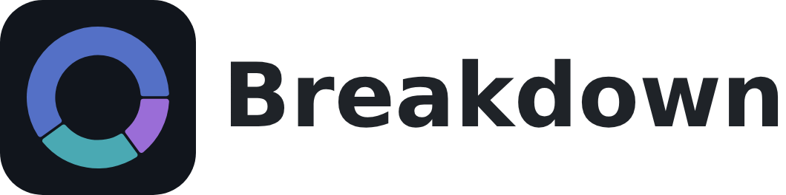

<picture>
  <source media="(prefers-color-scheme: dark)" srcset="docs/assets/readme-brand-dark.png" />
  
</picture>

---

A local portfolio-tracking and analysis app for understanding what you own,
which companies your ETFs actually expose you to, and whether your money is
allocated as planned. All portfolio data is stored locally on your computer.


<small>*Demo portfolio with synthetic holdings.*</small>

## What this app can do

This app is designed to help you understand your current holdings, analyze
the underlying exposure of your ETFs, and inform rebalancing decisions. Its
key features are:
- Track stocks, ETFs, crypto, and physical gold in EUR, USD, or GBP using public market quotes or manually entered prices.
- Group assets into categories and optionally define target allocations (e.g., 60% equities / 40% bonds).
- Set targets for individual assets within categories (e.g., 70% MSCI World / 30% MSCI EM within equities).
- Break down supported ETFs into their underlying holdings, combining direct and indirect exposure (e.g., NVIDIA shares held directly and through an MSCI World ETF).
- Analyze portfolio exposure by theme, sector, and geography.
- Examine portfolio beta, annualized volatility, and correlations between assets.

The app focuses on analyzing current holdings rather than tracking historical
performance. It does not reconstruct or maintain a complete transaction or
return history, connect to brokerage accounts, automatically import holdings,
execute trades, or calculate taxes. Automatic ETF breakdowns are limited to
supported providers, and underlying holdings data may be missing or incomplete.

## How to use

### Install a release

For the easiest setup, download the latest version for your operating system from the
[GitHub releases page](https://github.com/eliaskempf/portfolio-breakdown/releases/latest).
Prebuilt packages do not require Python or uv.
- **Windows:** Download the `windows-x64-setup.exe` installer and follow the setup instructions. Launch **Portfolio Breakdown** from the Start Menu or desktop shortcut.
- **Linux (Ubuntu 22.04/24.04, x64):** Download and install the `.deb` package, then launch the app from your applications menu.
- **macOS (experimental, Apple Silicon, macOS 14+):** Download the `.dmg`, open it, and drag **Portfolio Breakdown Experimental** into **Applications**. The app is not signed or notarized, so macOS may block it from opening.

Portable versions are also available for Windows (`.zip`) and Linux (`.tar.gz`), which
can be extracted and run without installation.

For platform-specific instructions, known limitations, and uninstallation, see the
[installation guide](docs/user/install.md).

### Run from source

If you prefer to run the app from source or want to contribute to development,
install [uv](https://docs.astral.sh/uv/getting-started/installation/) and run:

```sh
git clone https://github.com/eliaskempf/portfolio-breakdown.git
cd portfolio-breakdown
uv sync --locked
uv run portfolio-app
```

`uv` automatically manages Python and the project environment.

On Windows, use `uv run portfolio-desktop` to launch the standalone window. You
can also try the app with demo data using `uv run portfolio-app --demo`, or add
`--offline-demo` to use synthetic data without an internet connection.

### Documentation

For an introduction to the app, follow the [getting-started guide](docs/user/getting-started.md)
or take the optional in-app tour.

The [user guide](docs/user/index.md) covers imports, calculations, backups, troubleshooting,
and other features. Installed versions also include offline documentation, accessible through
**? → User guide**.

## Disclaimer

Portfolio Breakdown is a portfolio analysis tool, not investment advice. Market data,
ETF holdings, classifications, and calculations may be delayed, incomplete, or inaccurate.
Always verify important information independently before making investment decisions.

[GPL-3.0-only](LICENSE).
