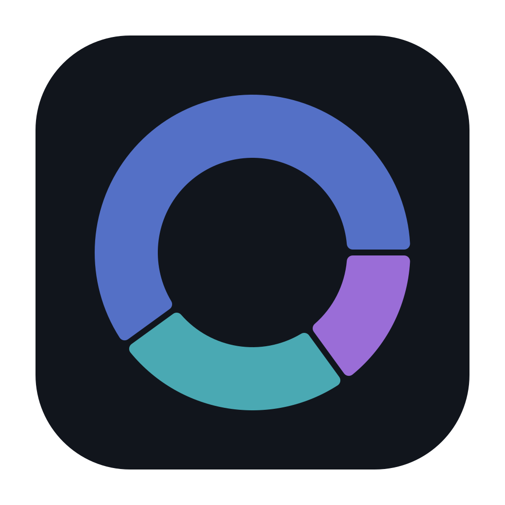
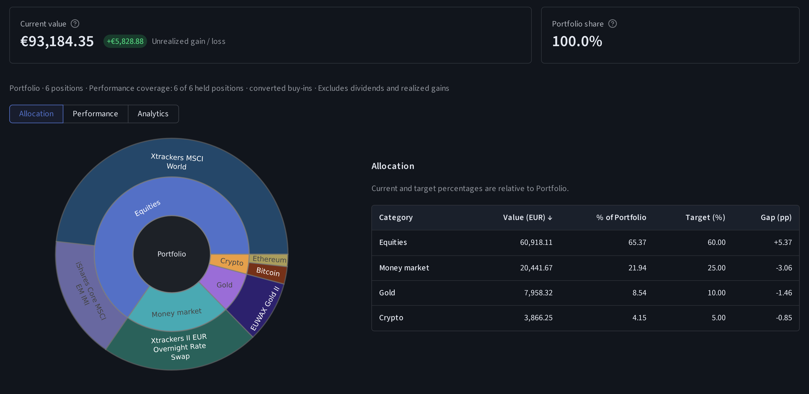

<h1>
  
  Portfolio Breakdown
  <br clear="both" />
</h1>

A local portfolio-analysis app for understanding what you own, what is inside your
ETFs, and how your allocation compares with your targets. Your portfolio is stored
on your computer. Windows uses a standalone app window; Linux uses your browser.



*Illustrative offline demo: all holdings, prices, buy-ins and targets are synthetic.*

## What it can do

- Add holdings manually or review an experimental CSV/Excel holdings import.
- Explore categories, optional allocation targets, and within-category targets.
- Value stocks, ETFs, crypto and physical gold in EUR, USD or GBP using public quotes or manual prices.
- Break down supported ETFs and combine direct and indirect exposure.
- Review gains against recorded costs, historical risk, and rebalancing suggestions.
- Try an editable demo with live market data, or take the guided offline tour.
- Create portable portfolio backups and restore them into a new workspace.

It does not connect to brokerage accounts, place trades, calculate taxes, or
reconstruct a complete transaction/return history. ETF coverage depends on
supported sources; missing or partial data stays visible. FinanzManager report
recognition is provisional. The futures sandbox is not included.

## How to use

### Install a release

Download from [Releases](https://github.com/eliaskempf/portfolio-breakdown/releases).
On Windows, run **windows-x64-setup.exe**, then open **Portfolio Breakdown** from
the Start Menu. Python and uv are not required. Setup offers WebView2 installation
when needed; a browser fallback and portable ZIP are also available. On Linux,
extract **linux-x64.tar.gz** and run `portfolio-app`.

Until the first release is published, test packages are available from successful
[Build candidate runs](https://github.com/eliaskempf/portfolio-breakdown/actions/workflows/candidate.yml).
Extract the downloaded Actions artifact to find its installer or application archive.
These are test candidates, not official releases.

### Run from source

Install [uv](https://docs.astral.sh/uv/getting-started/installation/), then:

```sh
git clone https://github.com/eliaskempf/portfolio-breakdown.git
cd portfolio-breakdown
uv sync --locked
uv run portfolio-app
```

`uv` manages Python and the project environment. On Windows, use
`uv run portfolio-desktop` for the standalone window. `uv run portfolio-app --demo`
opens the live demo; add `--offline-demo` for synthetic offline data.

### Get started and find help

Start with the [getting-started walkthrough](docs/user/getting-started.md), or take
the optional tour inside the app. The [full user guide](docs/user/index.md) covers
setup, imports, calculations, backups and troubleshooting.

Installed builds include matching offline documentation under **? → User guide**.
The [documentation website](https://eliaskempf.github.io/portfolio-breakdown/) is
prepared for GitHub Pages publication; until it is enabled, use the bundled guide
or the source links above.

## Before making investment decisions

Portfolio Breakdown is an analysis tool, not investment advice. Quotes, fund
holdings, classifications and calculations may be delayed, incomplete or wrong.
Verify important information independently and do not make investment decisions
solely from the app's charts or suggestions. You remain responsible for your
investment decisions and their risks.

[GPL-3.0-only](LICENSE).
