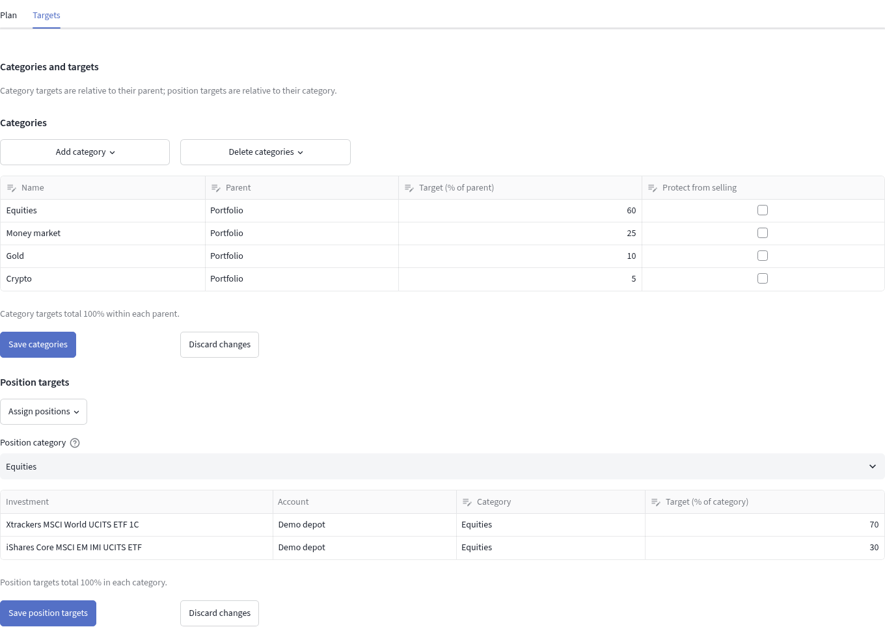

# Categories and targets {#categories}

## Build the strategic tree {#targets}

Open **Rebalance → Targets**. In an older workspace, review the preview for
enabling strategic allocation before saving. The app preserves legacy target
cells; it does not infer a global plan from current market values.

Add categories, save them, then use saved categories as parents. Assign each
position to one leaf category. Unassigned positions stay visible. Review and save
category edits and position targets separately; **Discard changes** abandons a
draft. Move child categories and positions before deleting their parent.

Category targets are percentages of their **parent**. A position target is a
percentage of its **own category**. Global targets multiply these fractions.
For example, in an invented plan a category targeting 40% of the portfolio and a
position targeting 25% within it imply a 10% portfolio target. Required sibling
targets must be complete and sum to 100%; the app does not silently normalize
saved targets. Blank means unknown, while zero is an explicit target.

[](assets/demo-targets.png)

*Synthetic offline example: 60% for Equities × 70% for its World ETF gives a 42%
portfolio target. The two grids use different denominators. Save categories and
Save position targets commit their respective edits separately. These percentages
illustrate the controls, not a recommended allocation. Open the image for detail.*

Moving a position preserves its within-category target. Check the destination's
total after moving it. Zero-quantity positions can carry nonzero targets for
future investments. Empty categories retain their targets without artificial
chart area.

## Read the Overview {#overview}

Select a category to focus its chart, allocation table and positions. Current
and target percentages use the selected category as their denominator. Back,
the category selector, or the chart center returns to a parent. Parent rows
include descendants: adding parent and child values double-counts them.
Missing prices suppress complete percentages; the chart represents known value.
Exposure filters and ETF expansion do not alter strategic ownership.

## Analytical labels are separate {#classifications}

Strategic categories are a non-overlapping ownership tree. Analytical taxonomies
can describe several aspects of the same asset, such as sector, theme and
geography. Edit `classifications.yaml` in the private workspace for these labels.
Back it up first and preserve asset IDs. An invented example for an instrument
whose ID is `example-company`:

```yaml
example-company:
  classifications:
    sector:
      - [Industry, Example services]
    theme:
      - [Example theme, Example activity]
```

Taxonomy names and depths are flexible. An asset assigned to several distinct
paths splits its value equally among them; repeated identical paths are ignored.
Full paths distinguish identically named nodes under different parents. Missing
membership becomes **Unclassified**. An **Assigned here** chart leaf preserves
value attached directly to an internal node. An empty file mapping `{}` is valid.

Legacy workspaces without strategic allocation use whole-portfolio position
targets in `target_allocation`. Filtered legacy targets retain their original
portfolio basis. Review migration in Targets before relying on category-relative
planning. See [Exposure](exposure.md#filters) for analytical filtering.
